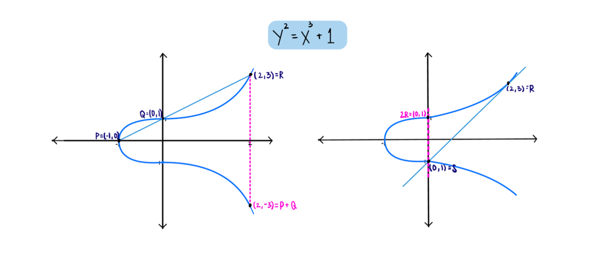
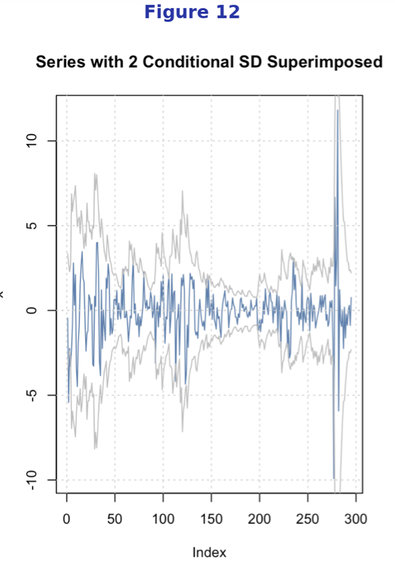

### Data-Driven Patterns in Elliptic Curves
*Undergraduate Research | UCSB Direct Reading Program | January – June 2025*

:::: {layout="[85,15]"}
::: {}
Collaborated with a PhD candidate in the UCSB Math Department to explore statistical patterns in elliptic curves. 
Analyzed 1 million curves from the LMFDB using Python and PostgreSQL, and built classification models to predict curve rank.

[View Poster](files/DRP_Poster.pdf)   
:::

::: {}

### Time Series Analysis of U.S. Quarterly GDP Growth
*PSTAT 174 - Time Series | UC Santa Barbara | March 2025*

:::: {layout="[60,40]"}
::: {}
This project analyzes quarterly U.S. real GDP growth from 1950 to 2024
using SARIMA and ARMA-GARCH time series models, capturing seasonal patterns
and time-varying volatility with an 8-quarter forecast.

[PDF](files/Time Series Report.pdf)   [R Code](files/Time Series Report.pdf#page=14)
:::

::: {}

:::
::::

### Pension Fund Investment Risk
*PSTAT 177 - Financial Market Risk and Modeling | UC Santa Barbara | June 2025*

:::: {layout="[55,45]"}
::: {}
<small>Simulated 1,000 market scenarios to evaluate portfolio allocations for a municipal
retirement fund over a 30-year horizon, assessing insolvency risk, volatility,
and ending surplus across equity/fixed-income splits</small>

[PDF](files/PSTAT_177_final.pdf)
:::

::: {}

:::
::::
